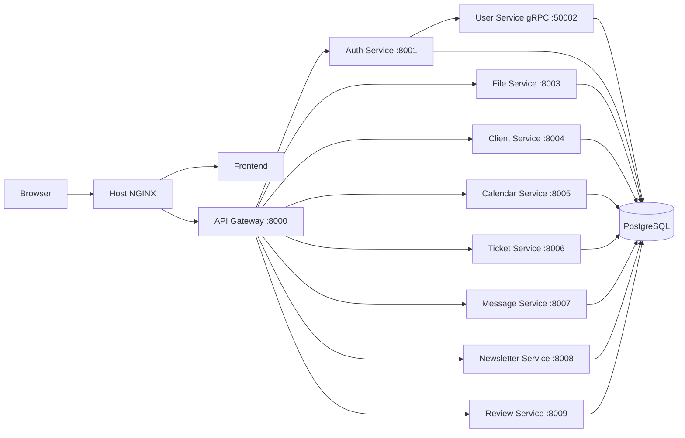
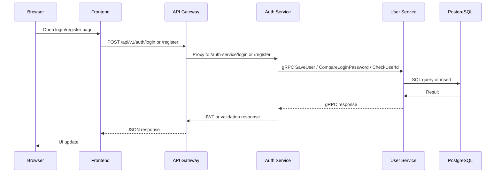

# Family STEAM Project Audit Report

## Executive Summary

Family STEAM is a Go microservice platform with a static frontend, an API gateway, service-specific HTTP and gRPC backends, PostgreSQL persistence, and host-managed NGINX proxying.

The repository was structurally sound, but several runtime mismatches prevented the application from behaving as intended until the service entrypoints, Dockerfiles, and JWT handling were aligned.

## Architecture Overview

- Frontend static site under `frontend/public`
- API Gateway on port `8000`
- Auth Service on port `8001`
- File Service on port `8003`
- Client Service on port `8004`
- Calendar Service on port `8005`
- Ticket Service on port `8006`
- Message Service on port `8007`
- Newsletter Service on port `8008`
- Review Service on port `8009`
- User Service gRPC on port `50002`
- PostgreSQL on port `5432`

## Dependency Graph

## Service Communication Diagram

## Issues Discovered

1. Several service binaries ignored their service-specific port environment variables and defaulted to the generic `PORT` variable.
2. Dockerfiles were built from the wrong module location and exposed `8080` for services that do not listen on `8080`.
3. The user service entrypoint was an HTTP placeholder even though the repository already contained a gRPC server implementation.
4. The auth service entrypoint was a placeholder server and did not wire the real handlers.
5. The gateway JWT middleware used a hardcoded secret and no timeout on the auth-service verification request.
6. The repository contains a second legacy API gateway `main.go` at the module root that is not used by the Docker build path.

## Repair Summary

- Aligned service entrypoints to their compose env vars and ports.
- Converted the user service to a real gRPC server.
- Wired auth-service routes to the handler implementations already present in the repository.
- Rebuilt Dockerfiles around each service module.
- Made gateway JWT validation environment-driven and method-checked.
- Added a timeout to the auth verification call in the gateway middleware.

## Validation Summary

- `go mod tidy` was run for every service module.
- `go build ./...` succeeds for every service module.
- `docker compose --env-file config/docker.env config` succeeds.
- `docker compose --env-file config/docker.env up -d --build` was started and the build pipeline progressed through all service images.
